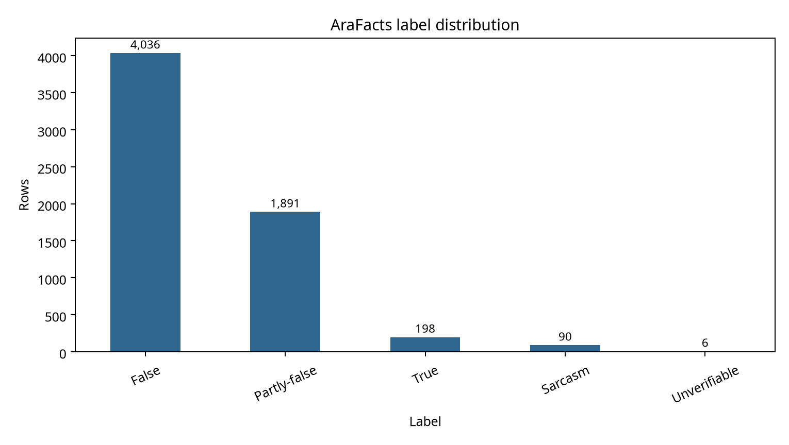
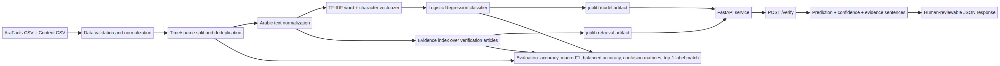
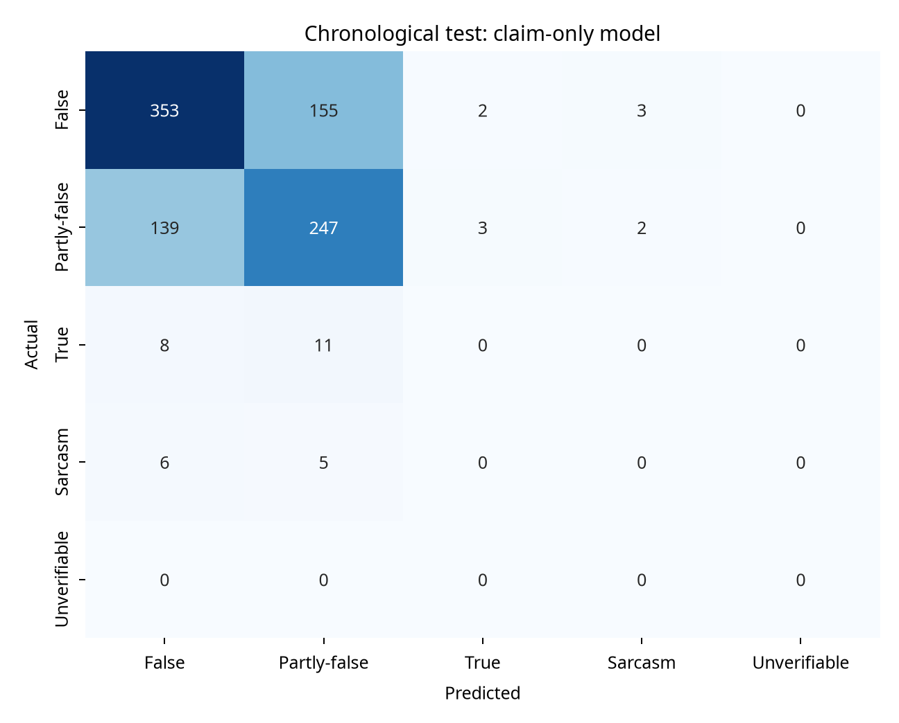
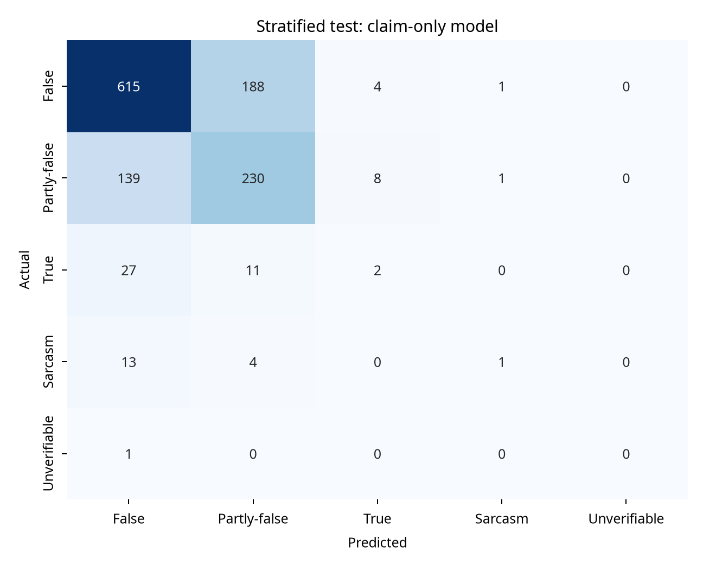

# ميزان — Mizan

**ميزان** هو نظام عربي قابل للمراجعة للتحقق من الادعاءات. بدل أن يعيد تصنيفًا ثنائيًا من نوع «خبر صحيح/زائف» فقط، يفصل المشروع بين ثلاث مهام واضحة: تصنيف الادعاء، استرجاع مقالات تحقق مشابهة، وعرض جمل دليل ومصدر يمكن للإنسان مراجعتها. إذا كانت الثقة أو صلة الدليل منخفضة، تعيد الخدمة `insufficient_evidence` بدل تقديم حكم قطعي غير مدعوم.

> **حدود مهمة:** ميزان نموذج بحثي وPortfolio قابل لإعادة الإنتاج، وليس جهة تحقق رسمية ولا بديلًا عن قراءة المصدر الأصلي. ضعف تمثيل الفئات النادرة في AraFacts ينعكس مباشرة على أداء تلك الفئات، ولذلك يعرض المشروع Macro-F1 ومصفوفات الالتباس ولا يكتفي بالدقة.

## لماذا هذه الفكرة؟

بعد مقارنة ثماني أفكار وفق القيمة العملية، العمق التقني، الأصالة، قابلية التنفيذ، وقوة العرض في Portfolio، حصل مشروع التحقق العربي القائم على الأدلة على أعلى نتيجة موزونة: **97/100**. يتجاوز المشروع تكرار كاشف الأخبار الزائفة الثنائي بإضافة الاسترجاع، التفسير، عتبة الامتناع، ومنهجية تقييم تمنع تسرب المقالات بين التدريب والاختبار. الجدول التالي يلخص أعلى المرشحين قبل الاختيار.

| الترتيب | الفكرة | البيانات المقترحة | الدرجة الموزونة | سبب عدم اختيارها أو اختيارها |
|---:|---|---|---:|---|
| 1 | ميزان: التحقق العربي بالأدلة | AraFacts وAuRED | **97** | قيمة اجتماعية واضحة، فجوة عربية، Demo قابل للمراجعة، وتقييم قابل لإعادة الإنتاج |
| 2 | كشف سلوك التهديدات متعدد الإشارات | بيانات IDS/IoT/Malware | 90 | قوي تقنيًا، لكن توحيد الصيغ والتحقق من التراخيص أصعب |
| 3 | تحديد العيوب الصناعية | MVTec AD | 86 | عرض بصري ممتاز، لكنه مجال مزدحم وترخيصه غير تجاري |
| 4 | الصيانة التنبؤية مع عدم اليقين | NASA C-MAPSS | 86 | مفيد، لكنه مكرر جدًا في المشاريع العامة |
| 5 | مراقب شذوذ متدفق واعٍ بالتكلفة | NAB | 85 | فكرة جيدة، لكن الـBenchmark ناضج والمنافسة عالية |

## البيانات والمصادر

يعتمد الإصدار القابل لإعادة الإنتاج على مستودع **AraFacts** الأكاديمي، الذي يصف مجموعة من الادعاءات العربية ومقالات التحقق المرتبطة بها [1]. النسخة الخام المتاحة محليًا تحتوي على **6,222** ادعاء، وبعد إزالة سجل مكرر يصبح الإطار المعالج **6,221** سجلًا. تشمل الحقول الادعاء، المصدر، التاريخ، التصنيف، ومحتوى مقالة التحقق. الترخيص الظاهر للمستودع هو **CC BY-NC 4.0**؛ لذلك لا تُضمّن البيانات الخام في Git ولا ينبغي استخدام المشروع تجاريًا دون مراجعة الحقوق [2].

| الملصق | العدد المعالج | النسبة التقريبية |
|---|---:|---:|
| False | 4,036 | 64.9% |
| Partly-false | 1,891 | 30.4% |
| True | 198 | 3.2% |
| Sarcasm | 90 | 1.4% |
| Unverifiable | 6 | 0.1% |



استخدمت نتائج بحث AuRED كمرجع لتحديد الاتجاه البحثي، لا كبيانات تدريب مخلوطة مع AraFacts؛ فالدراسة تعالج الشائعات العربية مع أدلة من جهات رسمية وتشير إلى أن استرجاع الأدلة أسهل من التحقق النهائي من الادعاء [3]. هذا الفصل يمنع تضخيم النتائج بسبب اختلاف المهمة أو تسرب البيانات.

## ما الذي يبنيه المشروع؟

يدخل المستخدم ادعاءً عربيًا. يطبع النظام النص تطبيعًا محافظًا، ثم يصنفه بنموذج `claim-only`، ويسترجع أعلى مقالات تحقق مشابهة من فهرس TF-IDF مستقل. بعد ذلك يستخرج من المقال الأعلى صلة جملًا مرشحة للدليل، ويعيد المصدر والتاريخ والروابط المتاحة ودرجات الصلة. لا يستخدم المصنف المقال المسترجع لإصدار الحكم النهائي في النسخة العملية؛ هذه نقطة تصميم مقصودة لأن المقال الخطأ قد يجر النموذج إلى تصنيف خاطئ. ويحتفظ المشروع بنموذج evidence-conditioned في التقييم بوصفه خط أساس تشخيصيًا يقيس مقدار التحسن لو كان الدليل الصحيح معروفًا.



### المكونات التقنية

| المكوّن | التنفيذ | الغرض |
|---|---|---|
| التطبيع | NFKC، إزالة التشكيل والروابط، توحيد حروف عربية شائعة | تقليل اختلافات الكتابة مع الحفاظ على النص الأصلي |
| المصنف العملي | TF-IDF للكلمات والحروف مع Logistic Regression و`class_weight=balanced` | تصنيف `False`, `Partly-false`, `True`, `Sarcasm`, `Unverifiable` |
| استرجاع الأدلة | TF-IDF ثنائي الكلمات فوق الادعاء ومحتوى المقال | إيجاد مقالات تحقق مشابهة دون اتصال خارجي |
| تفسير الدليل | ترتيب جمل المقال الأعلى صلة بالادعاء | جعل الاستجابة قابلة للمراجعة البشرية |
| طبقة الأمان | عتبة صلة `0.05` وثقة `0.45` افتراضيًا | إعادة `insufficient_evidence` عند ضعف الدعم |
| الواجهة | FastAPI مع OpenAPI | تشغيل محلي وطلب JSON قابل للدمج |

## التقييم القابل لإعادة الإنتاج

أُجري تقييمان مختلفان. الأول **زمني 70/15/15** على أساس التاريخ، بحيث يمثل الاختبار فترة مستقبلية من 13 ديسمبر 2020 إلى 1 مارس 2021. والثاني **طبقي 80/20** لتقدير الأداء داخل التوزيع مع الحفاظ على نسب الفئات. أثناء قياس الاسترجاع لا تُستخدم مقالات الاختبار في الفهرس؛ أما artifacts النهائية فتُدرّب على كل البيانات بعد اكتمال القياس من أجل التشغيل المحلي.

| البروتوكول | السيناريو | Accuracy | Macro-F1 | Balanced accuracy |
|---|---|---:|---:|---:|
| زمني | claim-only، وهو نموذج الخدمة | 0.642 | 0.261 | 0.330 |
| زمني | evidence-conditioned مع المقال الصحيح | 0.879 | 0.357 | 0.457 |
| زمني | evidence-conditioned مع المقال المسترجع | 0.550 | 0.186 | 0.260 |
| طبقي | claim-only، وهو نموذج الخدمة | 0.681 | 0.301 | 0.295 |
| طبقي | evidence-conditioned مع المقال الصحيح | 0.855 | 0.408 | 0.393 |
| طبقي | evidence-conditioned مع المقال المسترجع | 0.625 | 0.224 | 0.226 |

بلغت مطابقة ملصق المقال الأعلى استرجاعًا **0.510** في الاختبار الزمني و**0.592** في الاختبار الطبقي، مع متوسط تشابه TF-IDF قدره **0.252** زمنيًا و**0.291** طبقيًا. هذه النتيجة توضح الفجوة البحثية التي يستهدفها المشروع: جودة التصنيف ترتفع بوجود الدليل الصحيح، لكن الاسترجاع السطحي ليس كافيًا بعد. الفئات `True` و`Sarcasm` و`Unverifiable` نادرة جدًا، ولا يجوز تفسير الدقة الكلية وحدها بوصفها جودة متوازنة.





توجد كل الأرقام الخام في [`artifacts/metrics.json`](artifacts/metrics.json)، مع تنبؤات الاختبار ومصفوفات الالتباس. وتوجد مناقشة القيود والبروتوكول في [`docs/evaluation.md`](docs/evaluation.md).

## التشغيل المحلي

### 1. تجهيز البيانات

نزّل AraFacts من المصدر الأكاديمي أو المستودع الرسمي، ثم ضع الملفين التاليين محليًا دون إضافتهما إلى Git:

```text
data/AraFacts.csv
data/AraFacts_content.csv
```

### 2. تثبيت المشروع

```bash
python3 -m venv .venv
. .venv/bin/activate
pip install -e ".[dev]"
```

### 3. التدريب وإنتاج artifacts

```bash
make train CLAIMS=data/AraFacts.csv CONTENT=data/AraFacts_content.csv
```

أو بصورة مباشرة:

```bash
PYTHONPATH=src python scripts/train.py \
  --claims data/AraFacts.csv \
  --content data/AraFacts_content.csv \
  --output-dir artifacts \
  --model-dir models
PYTHONPATH=src python scripts/make_report.py --artifacts artifacts
```

ينتج التدريب `models/classifier.joblib` و`models/retriever.joblib`، إضافة إلى `metrics.json` وملفات CSV والصور. ملفات النموذج كبيرة نسبيًا، ولذلك تُستبعد افتراضيًا من Git ويمكن توليدها محليًا.

### 4. تجربة CLI

```bash
PYTHONPATH=src python scripts/predict.py \
  "انتشر خبر يزعم أن قرارًا جديدًا دخل حيز التنفيذ" \
  --model-dir models
```

### 5. تشغيل API

```bash
make api
```

ثم أرسل طلبًا:

```bash
curl -X POST http://localhost:8000/verify \
  -H 'Content-Type: application/json' \
  -d '{"claim":"انتشر خبر يزعم أن قرارًا جديدًا دخل حيز التنفيذ","top_k":3}'
```

تتوفر وثائق OpenAPI على `http://localhost:8000/docs`، وفحص الصحة على `/health`، والبيانات الوصفية على `/metadata`. مثال مختصر للاستجابة:

```json
{
  "claim": "...",
  "verdict": "False",
  "confidence": 0.63,
  "evidence_status": "sufficient",
  "evidence": {
    "claim_id": "...",
    "source": "...",
    "sentences": [{"text": "...", "score": 0.31}]
  },
  "candidates": []
}
```

### 6. الاختبارات

```bash
make test
```

## بنية المستودع

| المسار | المحتوى |
|---|---|
| `src/mizan/text.py` | التطبيع وتقسيم الجمل |
| `src/mizan/data.py` | تحميل AraFacts وإزالة التكرار والتقسيم |
| `src/mizan/model.py` | المصنف وحفظ artifacts |
| `src/mizan/retriever.py` | فهرس الأدلة والاسترجاع وترتيب الجمل |
| `src/mizan/service.py` | منطق القرار والامتناع والاستجابة |
| `src/mizan/api.py` | FastAPI endpoints |
| `scripts/train.py` | التدريب والتقييم وحفظ النتائج |
| `scripts/predict.py` | CLI للتنبؤ الفردي |
| `scripts/make_report.py` | توليد الرسوم |
| `tests/` | سبعة اختبارات وحدة وتكامل |
| `docs/design.md` | وثيقة التصميم التفصيلية |
| `docs/architecture.mmd` | المصدر القابل للتحرير للمخطط |
| `artifacts/` | metrics ورسوم وتنبؤات ناتجة من التشغيل |

## القيود وخطة التطوير

أكبر قيد هو عدم توازن البيانات: لا تحتوي فترة الاختبار الزمني على أمثلة `Unverifiable`، ولذلك لا يمكن ادعاء قدرة حقيقية على هذه الفئة من ذلك البروتوكول. كما أن الاسترجاع الحالي lexical وليس دلاليًا؛ وقد يختار مقالًا مشابهًا في الكلمات لكنه لا يعالج الادعاء نفسه. لا يجلب النظام صفحات ويب جديدة ولا يتحقق من الروابط لحظة الطلب، وهو قرار مقصود للسلامة وقابلية إعادة الإنتاج.

الخطوة التالية ذات القيمة الأعلى هي إضافة استرجاع دلالي عربي مع reranker مدرّب على أزواج claim/evidence، ثم طبقة stance تميز بين «يؤيد الادعاء» و«يفنده». بعد ذلك ينبغي ضبط عتبات الامتناع على validation set، وإضافة اختبار خارجي منفصل على AuRED دون خلطه مع AraFacts، ثم نشر model card يوضح الأداء حسب المصدر والفترة والفئة.

## الترخيص والاستخدام المسؤول

الكود متاح لأغراض تعليمية وبحثية وفق الترخيص المرفق. يجب تنزيل AraFacts وفق شروطه، حفظ الإسناد، وعدم إعادة توزيع البيانات الخام أو استخدام المشروع تجاريًا دون مراجعة ترخيص البيانات. لا يخزن ميزان نصوص المستخدم بعد الطلب ولا يتصل بمصادر خارجية في الإصدار الحالي.

## المراجع

[1]: https://aclanthology.org/2021.wanlp-1.26/ "AraFacts paper — WANLP 2021"

[2]: https://gitlab.com/bigirqu/AraFacts "AraFacts official repository"

[3]: https://aclanthology.org/2024.arabicnlp-1.3/ "AuRED: Arabic Rumor and Evidence Dataset"

[4]: https://www.nature.com/articles/s41598-026-45653-4 "Recent Arabic fake-news detection study"

[5]: https://www.mvtec.com/research-teaching/datasets/mvtec-ad "MVTec AD dataset"

[6]: https://data.nasa.gov/dataset/cmapss-jet-engine-simulated-data "NASA C-MAPSS dataset"

[7]: https://github.com/numenta/NAB "Numenta Anomaly Benchmark"
